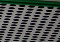
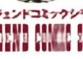

# SeemoRe - ICML 2024


### See More Details: Efficient Image Super-Resolution by Experts Mining

#### [Eduard Zamfir<sup>1</sup>](https://eduardzamfir.github.io), [Zongwei Wu<sup>1*</sup>](https://sites.google.com/view/zwwu/accueil), [Nancy Mehta<sup>1</sup>](https://scholar.google.com/citations?user=WwdYdlUAAAAJ&hl=en&oi=ao),  [Yulun Zhang<sup>2,3*</sup>](http://yulunzhang.com/) and [Radu Timofte<sup>1</sup>](https://www.informatik.uni-wuerzburg.de/computervision/)

#### **<sup>1</sup> University of Würzburg, Germany - <sup>2</sup> Shanghai Jiao Tong University, China - <sup>3</sup> ETH Zürich, Switzerland**
#### **<sup>*</sup> Corresponding authors**

[](https://arxiv.org/abs/2402.03412)
[](https://eduardzamfir.github.io/seemore/)
[](https://huggingface.co/spaces/eduardzamfir/SeeMoreDetails)

## Latest
- `05/29/2024`: Added 🤗[Demo](https://huggingface.co/spaces/eduardzamfir/SeeMoreDetails).
- `05/23/2024`: Code & ckpt & results release. [Google Drive](https://drive.google.com/drive/folders/15jtvcS4jL_6QqEwaRodEN8FBrqVPrO2u?usp=share_link)
- `05/02/2024`: SeemoRe has been accepted at ICML 2024! 🎉 
- `02/05/2024`: Technical report released on [arxiv](https://arxiv.org/abs/2402.03412).


## Method:
<br>
<details>
  <summary>
  <font size="+1">Abstract</font>
  </summary>
Reconstructing high-resolution (HR) images from low-resolution (LR) inputs poses a significant challenge in image super-resolution (SR). While recent approaches have demonstrated the efficacy of intricate operations customized for various objectives, the straightforward stacking of these disparate operations can result in a substantial computational burden, hampering their practical utility. In response, we introduce **S**eemo**R**e, an efficient SR model employing expert mining. Our approach strategically incorporates experts at different levels, adopting a collaborative methodology. At the macro scale, our experts address rank-wise and spatial-wise informative features, providing a holistic understanding. Subsequently, the model delves into the subtleties of rank choice by leveraging a mixture of low-rank experts. By tapping into experts specialized in distinct key factors crucial for accurate SR, our model excels in uncovering intricate intra-feature details. This collaborative approach is reminiscent of the concept of **see more**, allowing our model to achieve an optimal performance with minimal computational costs in efficient settings.
</details>


**Mixture of Low Rank Experts:**

<p align="center">

</p>


## Results:

<details>
  <summary>
  <font size="+1">Main Results</font>
  </summary>
<p align="center">

</p>
</details>

<details>
  <summary>
  <font size="+1">Visual Comparison</font>
  </summary>

|                     HR                     |                       Bicubic                   | [SwinIR-Light](https://github.com/JingyunLiang/SwinIR) | [DAT-Light](https://github.com/zhengchen1999/DAT) |     SeemoRe (ours)              |
| :----------------------------------------: | :---------------------------------------------: | :----------------------------------------------: | :-----------------------------------------: | :-----------------------------------------: |
|  |  |    |  |  |
|  |  |    |  |  |
|  |  |    |  |  |
|  |  |    |  |  |

</details>

## Install
Create a conda enviroment:
````
ENV_NAME="seemore"
conda create -n $ENV_NAME python=3.10
conda activate $ENV_NAME
````
Run following script to install the dependencies:
````
bash install.sh
````


## Usage
Pre-trained checkpoints and visual results can be downloaded [here](https://drive.google.com/drive/folders/15jtvcS4jL_6QqEwaRodEN8FBrqVPrO2u?usp=share_link). Place the checkpoints in `checkpoints/`.

In `options` you can find the corresponding config files for reproducing our experiments.

##### **Testing**
For testing the pre-trained checkpoints please use following commands. Replace `[TEST OPT YML]` with the path to the corresponding option file.
`````
python basicsr/test.py -opt [TEST OPT YML]
`````

##### **Training**
For single-GPU training use the following commands. Replace `[TRAIN OPT YML]` with the path to the corresponding option file.
`````
torchrun --nproc_per_node=1 --master_port=4321 basicsr/train.py -opt [TRAIN OPT YML] --launcher pytorch
`````

## Citation

If you find our work helpful, please consider citing the following paper and/or ⭐ the repo.

```
@inproceedings{zamfir2024details,
  title={See More Details: Efficient Image Super-Resolution by Experts Mining}, 
  author={Eduard Zamfir and Zongwei Wu and Nancy Mehta and Yulun Zhang and Radu Timofte},
  booktitle={International Conference on Machine Learning},
  year={2024},
  organization={PMLR}
}
```

## Acknowledgements

This code is built on [BasicSR](https://github.com/XPixelGroup/BasicSR).
